# Centro Médico Cliente

## Descripción
Este es un cliente web para un sistema de gestión de citas médicas, diseñado para que los pacientes puedan seleccionar el servicio y seguro, elegir fecha y hora, y proporcionar sus datos personales para completar el proceso de reserva.

### Características
- **Selección de servicios y coberturas**: Los usuarios pueden elegir entre diversos servicios médicos y coberturas de seguro.
- **Formulario de citas**: Los pacientes seleccionan la fecha y hora disponibles para su cita.
- **Gestión de datos del paciente**: Formulario completo para ingresar datos del paciente, incluyendo nombre, apellido, fecha de nacimiento, contacto y más.

### Tecnologías Utilizadas
- Angular para la creación de la interfaz.
- Material Design Components para un diseño limpio y moderno.
- RxJS para la gestión reactiva de datos.
- Bootstrap para diseño responsive.

### Imagenes del sistema desktop
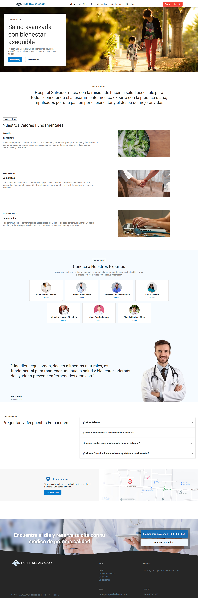
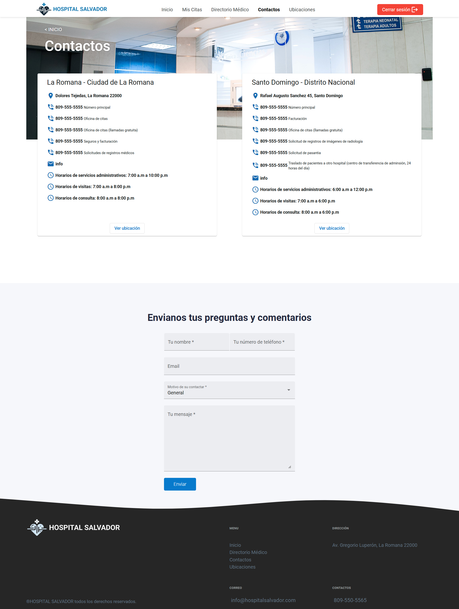
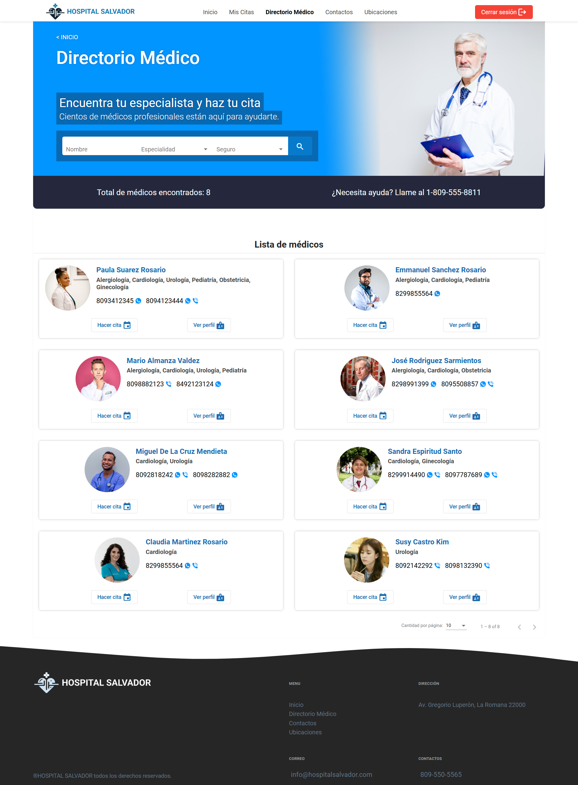
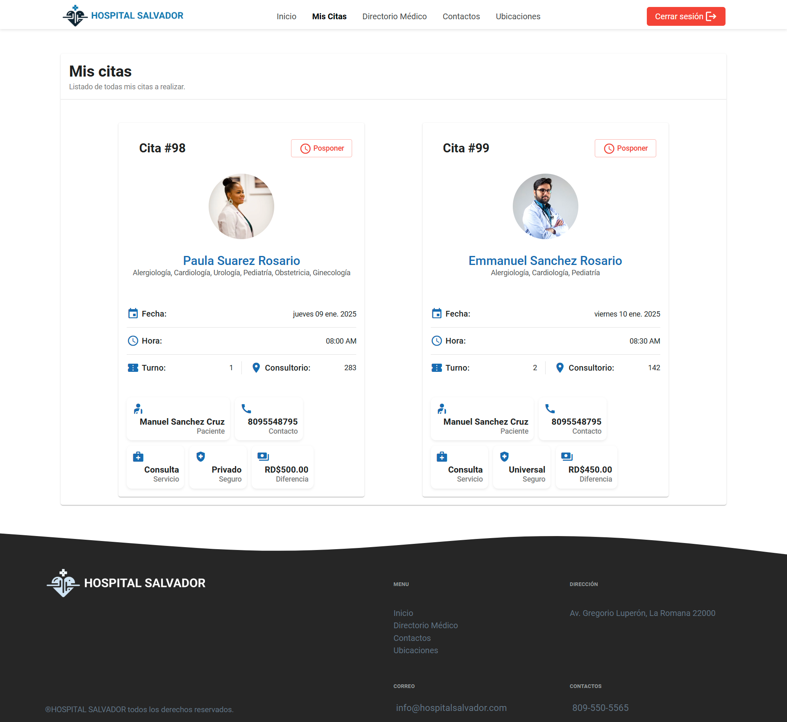
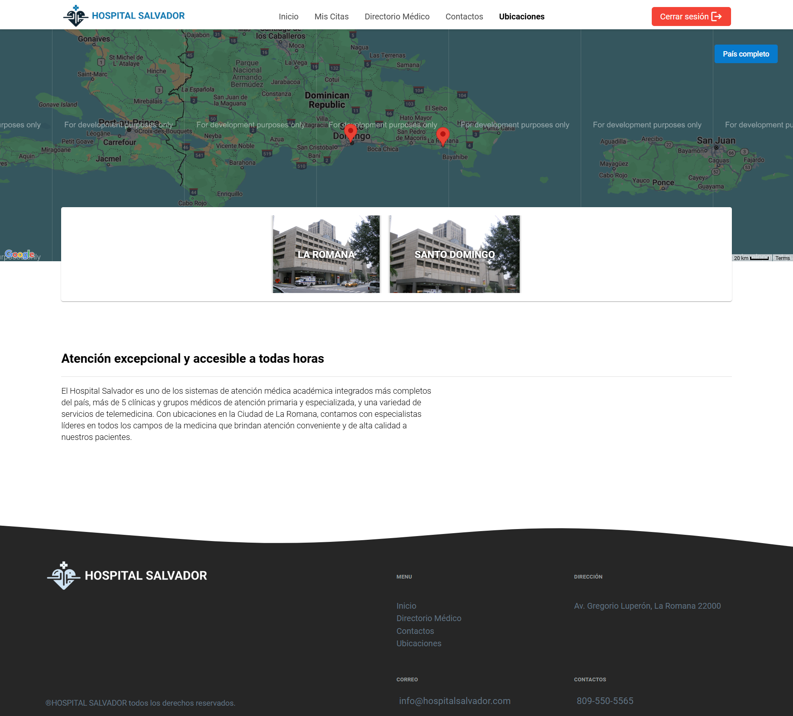
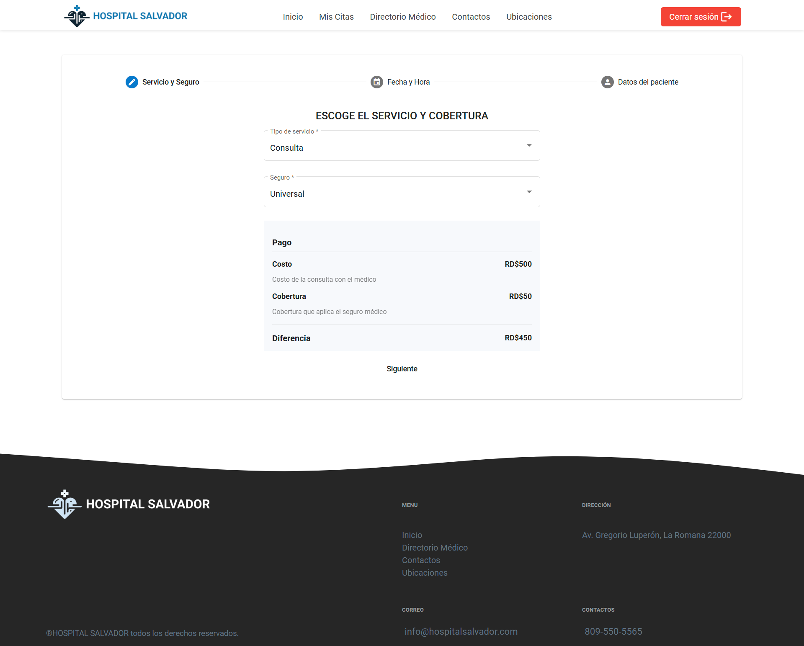
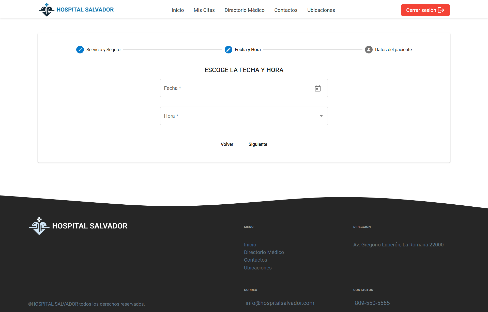
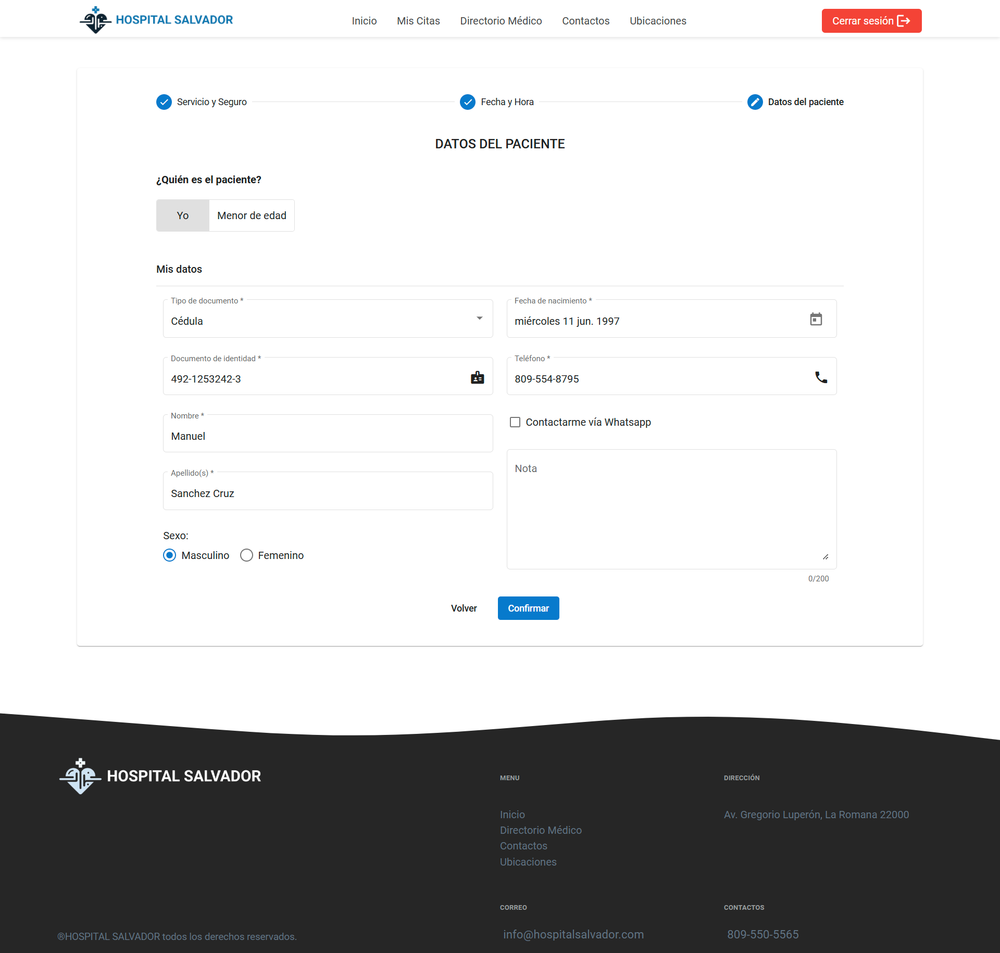
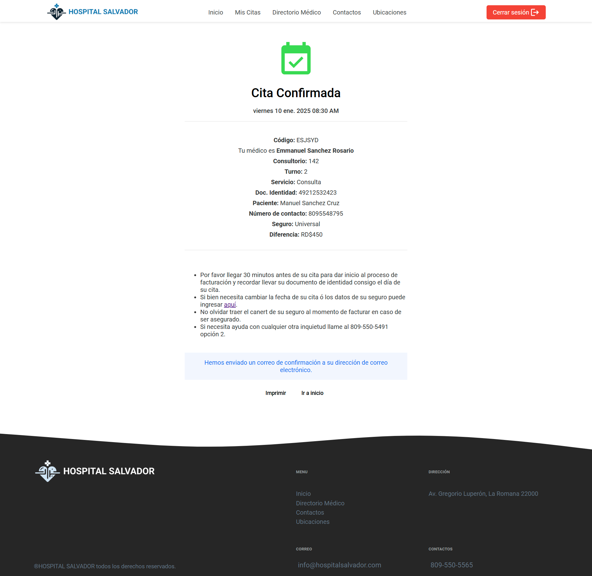

### Imagenes en movil
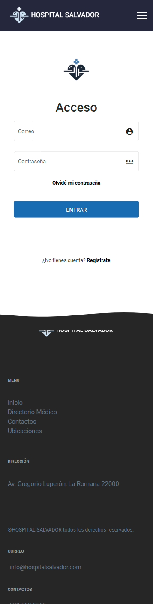
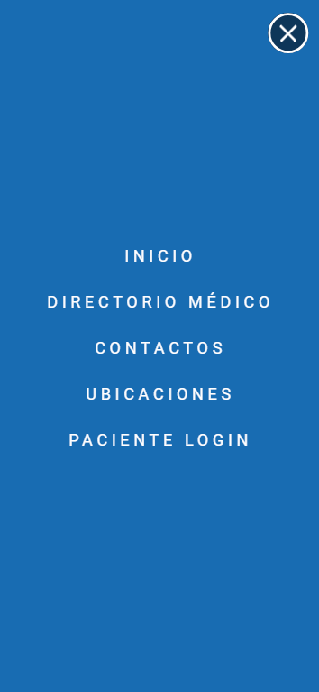
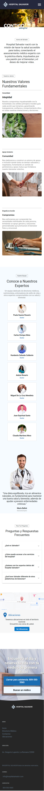
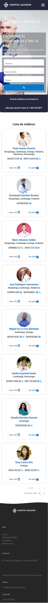
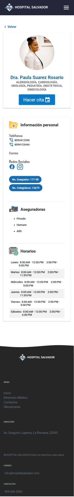
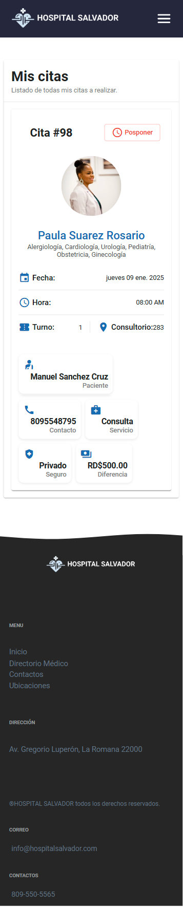
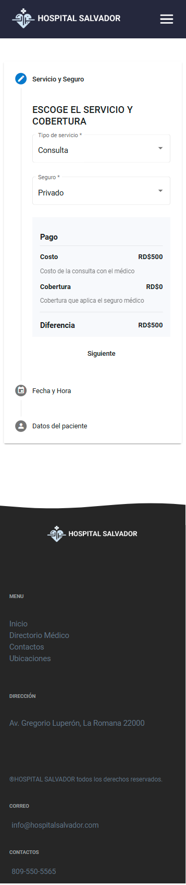
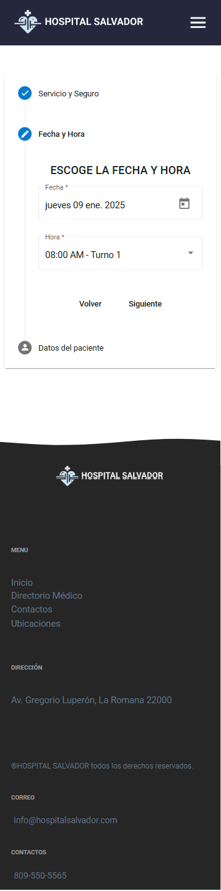
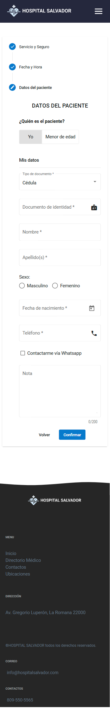
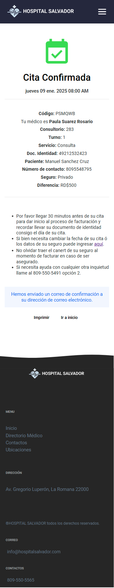
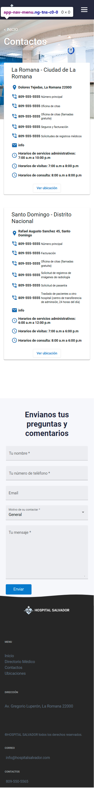
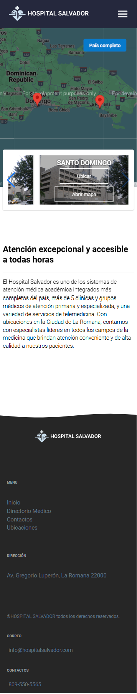

### Requisitos
1. **Angular CLI**: Asegúrate de tener instalado Angular en tu máquina.
2. **Node.js**: Versión recomendada 14.x o superior.
3. **Cuenta de Firebase**: Para la integración de autenticación.

## Instalación

1. Clona este repositorio:
    ```bash
    git clone https://github.com/KevinJ0/centromedico_cliente.git
    ```

2. Navega al directorio del proyecto:
    ```bash
    cd centromedico_cliente
    ```

3. Instala las dependencias:
    ```bash
    npm install
    ```

4. Ejecuta el servidor de desarrollo:
    ```bash
    ng serve
    ```

5. Abre el navegador en `http://localhost:4211/` para ver la aplicación en acción.

## Contribuciones
Si deseas contribuir al proyecto, por favor sigue estos pasos:
1. Haz un fork del repositorio.
2. Crea una nueva rama (`git checkout -b feature/nueva-funcionalidad`).
3. Realiza tus cambios y haz un commit (`git commit -am 'Añadir nueva funcionalidad'`).
4. Envía un pull request.
